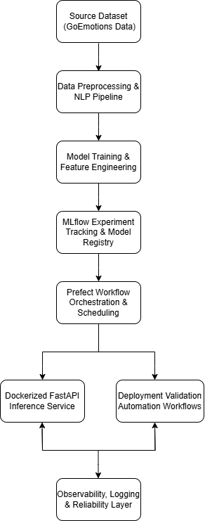

# 🧠 AI Infrastructure & Workflow Orchestration Platform

Production-oriented MLOps platform for orchestrating, tracking, deploying, and operationalizing machine learning workflows using MLflow, Prefect, FastAPI, and Docker.

Designed with a focus on workflow orchestration, deployment reliability, observability, and scalable AI infrastructure patterns.

## 💡 Problem

ML engineering teams lose significant time to manual workflow orchestration, inconsistent experiment tracking, and fragile deployment pipelines. Without a reliable infrastructure layer, model iterations are slow, reproducibility breaks down, and production deployments carry unnecessary risk.

This platform addresses that by providing a production-grade, self-service MLOps infrastructure - designed around the same principles that reduce developer toil in platform engineering: automation, observability, and reliable deployment workflows.

## 🏗️ Architecture Overview

This platform demonstrates a production-oriented AI infrastructure workflow for orchestrating, tracking, deploying, and operationalizing machine learning systems.

Key capabilities include:

- Automated ML workflow orchestration using Prefect
- Experiment tracking and model lifecycle management with MLflow
- Dockerized FastAPI inference services
- Deployment automation and validation workflows
- Scalable infrastructure patterns for operational ML systems
- Reliability-focused workflow design with monitoring and operational visibility

<p align="center">
  
</p>

## 🧠 Product decisions

**Why Prefect over Airflow:** Prefect's lightweight agent model reduces infrastructure overhead for teams that don't need a full Airflow cluster. The trade-off is less ecosystem maturity acceptable for teams prioritizing operational simplicity over feature breadth.

**Why MLflow for experiment tracking:** MLflow provides the right balance of flexibility and standardization for model lifecycle management. It integrates cleanly with existing Python workflows without forcing a platform migration reducing adoption friction for ML teams.

**Why FastAPI for inference serving:** FastAPI's automatic OpenAPI documentation and async support make it the right choice for developer-facing inference APIs. Prioritized developer experience and time-to-first-prediction over raw throughput optimization.

**Why Docker for deployment:** Containerization ensures deployment consistency across environments, the same principle behind reducing deployment failures in production infrastructure. Portability was prioritized over performance optimization at this stage.

## 📦 Dataset

We use a labeled emotion dataset for training and validation. You can preprocess the dataset using the provided `goemotion_dataset.ipynb` notebook.

## 🚀 Project Setup

### 1. Clone the repository

```bash
git clone https://github.com/your-username/emotion-recognition-mlops.git
cd emotion-recognition-mlops
```

### 2. Install dependencies
```bash
make setup
```

### 3. Add current directory to Python path
```bash
export PYTHONPATH="${PYTHONPATH}:${PWD}"
```

### 4. Set up environment variables
No environment variables are required for local development. 

### 5. Train & Register the Model
#### Train the model locally
```bash
python main.py
```
#### Register & Stage the Best Model
```bash
python stage.py --tracking_uri http://127.0.0.1:5000 --experiment_name your_experiment_name
```

### 6. Orchestrate with Prefect
#### Create deployments
```bash
prefect deployment create deployments.py
```
#### Create work queues
```bash
prefect work-queue create -t "ml-training" ml-training-queue
prefect work-queue create -t "ml-staging" ml-staging-queue
```
#### Run Prefect Orion server
```bash
prefect orion start
```
Access the Prefect UI at: http://localhost:4200
#### Trigger scheduled deployments
```bash
prefect deployment run mlflow-training/deploy-mlflow-training
prefect deployment run mlflow-staging/deploy-mlflow-staging
```

### 7. Deploy the Web Service
Navigate to the web_service/ directory and build the Docker image:
```bash
cd web_service
make build_webservice
```
This will:
- Build the Docker image
- Run code quality checks
- Expose the service at http://localhost:9696

### 8. Run the test client
You can run the test client to verify the model predictions:
```bash
python test.py
```
## 🖥️ User Interfaces

### FastAPI Web Service UI

Interact with the deployed model via the FastAPI web interface:


Example prediction request screen:


---

### MLflow Experiment Tracking UI

Track experiments, compare runs, and manage models with MLflow:


---

### Prefect Orion Workflow Orchestration UI

Monitor and manage your workflows using Prefect Orion:


Detailed view of deployments and task runs:


---

### Model Management UI

Visualize model registration and lifecycle stages:


## 📂 Project Structure
```
.
├── emotion_dataset_load.ipynb       # Data loading and preprocessing
├── main.py                          # Training pipeline
├── stage.py                         # Model registration/staging
├── deployments.py                   # Prefect deployment config
├── mlflow.db                        # MLflow local backend
├── model/
│   └── model-rgr.pkl                # Saved model
├── utils/
│   └── prepare.py                   # Feature engineering logic
├── web_service/
│   ├── Dockerfile
│   ├── Makefile
│   ├── Pipfile / Pipfile.lock
│   ├── app/
│   │   └── main.py                  # FastAPI app
│   ├── emotion_model/
│   │   ├── predict.py               # Model inference
│   │   └── utils.py                 # Text preprocessing
│   └── test.py                      # Request test script
```

## 🚀 Run FastAPI Web Service Locally

If you prefer to run the FastAPI app without Docker, follow these steps::

```bash
pipenv install
mlflow server --backend-store-uri sqlite:///mlflow.db --default-artifact-root ./mlruns --host 127.0.0.1 --port 5000
uvicorn main:app --host 127.0.0.1 --port 8000
```

| Component               | UI URL (Default)                    | Notes                                                  | Docker Image / Location                                 |
| ----------------------- | ----------------------------------- | ------------------------------------------------------ | ------------------------------------------------------- |
| **MLflow Tracking UI**  | `http://localhost:5000`             | MLflow UI for experiment tracking                      | Runs locally or in a container (mlflow image or custom) |
| **Prefect Orion UI**    | `http://localhost:4200`             | Prefect’s orchestration UI                             | Runs locally or in Prefect agent container              |
| **FastAPI Web Service** | `http://localhost:8000` | Your deployed model API & Swagger UI (auto at `/docs`) | Custom web\_service Docker image (your FastAPI app)     |

## 🔮 Future Improvements

- Kubernetes-based deployment orchestration
- OpenTelemetry tracing and centralized observability
- Automated retraining and evaluation workflows
- CI/CD integration using GitHub Actions
- Distributed inference scaling
- Model monitoring and drift detection
